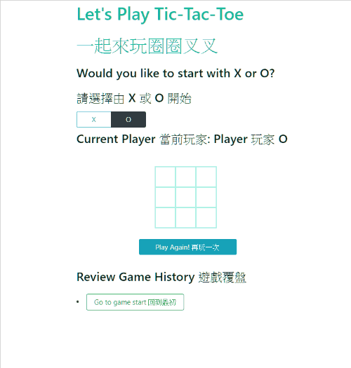

# React-Tic-Tac-Toe

- A bilingual (English and Traditional Chinese) tic-tac-toe game built on top of React Tutorial from [the official React Docs](https://reactjs.org/tutorial/tutorial.html)

---

<!-- - Screenshot

 -->

- Demo

### What is tic-tac-toe?

- Tic-tac-toe (American English), noughts and crosses (British English), or Xs and Os is a paper-and-pencil game for two players, X and O, who take turns marking the spaces in a 3×3 grid -- [Wikipedia](https://en.wikipedia.org/wiki/Tic-tac-toe).

- In Mandarin (at least in Taiwan), we call this game '圈圈叉叉' while '圈 (chiuān)' means 'circles' and '叉 (chā)' means 'crosses'.

---

### Features

- Bilingual instructions in English and Traditional Chinese.
- Plays games with 2 players.
- Player 1 can choose to start from X or O.
- Shows Current Player status.
- Shows Game Result message (which player won & if it was a draw).
- Players can review game history.
- Players can play this game multiple times.

### Future Features

- Further styling of the game.
- Better responsive web design.
- More game modes: 1 player (plays games with computer), 2 players, 2 players with game history (current version).
- Display the location for each move in the format (col, row) in the move history list.
- Bold the currently selected item in the move list.
- Rewrite Board to use two loops to make the squares instead of hardcoding them.
- When someone wins, highlight the three squares that caused the win.
- Deploy the game

---

©2020 Ellie Chen - All Rights Reserved.
